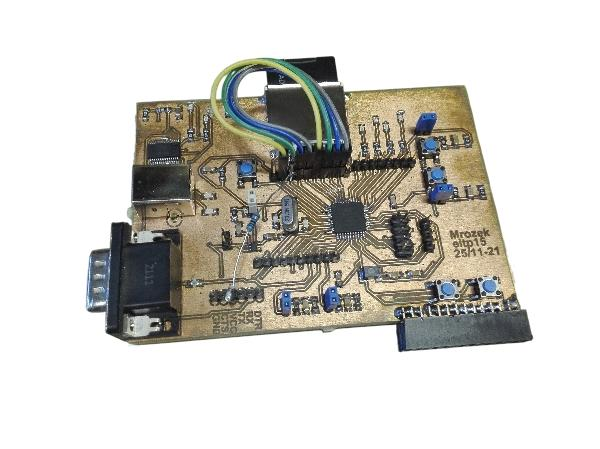

<pre>
This document is <b>Under construction</b>, so please don't expect too much logic or causality here. This will be a meaningful document. Potatoes.
</pre>
<title>Let's build a computer</title>

# Altium library for components at ETF

Have you ever wondered how electronics work? Did you just go to LTH and don't know what to do with all the endless theory? Don't worry, I've been in this situation!

I've been to LTH wondering what all the mathematics is for, until I discovered ETF. This place allows you to build hardware and see principles behind most of theory you learn at the university.

Low pass filter? You can make it!
Laplace transform on a chip? What is it for? (Hint: MP3/sound compression) Got it!
Flip-Flops and logical gates, D-transform? You can understand it by building the stuff!

There are thousands of components to choose from at ETF - ElektroTeknska foreningen vid LTH. It is a fantastic source of fun for young aspiring hardware hackers and makers.

But - if you want to build a professionally looking printed circuit board (like the one in sample pictures), you want to make a design. You can do it with specialized software like KiCad or Altium.

PCB stands for Printed Circuit Board. This is the board you can see in the picture. Like this:

Exactly this PCB was created as I was attending to a course in my school, but hey, I've done these boards independently before. This is the most beautiful board I created so far.

Here, we try to create a library of components available for students and everyone who is interested in hardware making. With this library you will be able to create some simple and even slightly more complex designs.

# Starting point: Create the PCB

We can draw circuit boards by hand. I'm serious. There are pens for drawing them and we won't use them, because a chip I am using is way too complex. We want to connect a microcontroller to our design and pathways are way too small to be drawn by hand.

## Design the schematic

When designing electronics I always look up to my mentor, CC. While he does not always <voiceover: insert something stupid about him>, he is very sharp in developing and building test prototypes. When we were building stuff, we aimed at the stars. Some wise people say that while standing on axes of giants, you cannot see the world behind the cloud, but we did not care too much at the time.

I am going to describe how we used to develop circuit boards using professional toolkit called Altium Designer, and we are going to deep dive using the components we have at hand. We are going to start by creating a library of components. Inside of the library, we will have schematics and footprints. We are going to compile the library using Altium and use these components in our design. We will place and route footprints and manufacture the PCB using photochemical method. This is the hard way of doing things, but I believe that you get most of it and you learn to understand challenges associated with this process.

## PCB Layout

<todo: Describe how you created the PCB in Altium>

## Fabrication process: Photochemistry vs. Ordering from a Supplier

Fabrication of PCB using photochemistry has only one real life scenario: when you need the PCb *really* fast (1-2 days max). Normally, it's easier to order the PCB from internet, but I want to tell you my story, so we'll do it like I have done it before. Spoiler alert: this will "waste" lots of your time (took me a couple of evenings to figure out all parameters), but you will see how much effort is really needed to produce one circuit board. If you want to make one card at home, just jump directly to Alternative sourcing and skip photochemical method.

### Photochemical method

Hazard ahead: This method is potentially dangerous as you will be handling acids. While they won't kill you, they can make significant holes in your clothes, or at least make them look yellowish.

If you got here, you'll make your fingers dirty. To make us a PCB we need the following ingredients:
- PCB Laminate
- Overhead paper (use one for inkjet printers, won't work with laser printers)
- NaOH
- Etsmedel <todo: How is this thing called? What is it's formula?>
- Clothes (If you get stains)

#### Print layout to a sheet of plastic
We need to start by printing out our layout to a sheet of plastic paper. Altium prints via Output Print Jobs and each job is a file. We need to create Output Print Job in Altium and use printer to print it to a sheet of plastic paper.

### Alternative sourcing

To obtain your PCB with less effort, use one of the following services online: jlcpcb.com or pcbway.com. There are probably some other services which are popular (better?). If you know of any such services, let me know. I used jlcpcb with good results, and they are quite cheap too (200SEK for set of 5 small PCBs with shipping). You will probably need to create an account on this website, so have your throwaway e-mail account ready.

### Assembly: Soldering components

We made it to the point where we hold the PCB in our hand. Now it's time to solder components to the board. In situations where you have a laboratory available you try to go with components which are at hand. Otherwise you may want to order them from a reseller. There are some nice ones I use (I'm not getting paid for saying this, perhaps I should).

### Writing and uploading initial code

The card we built has a JTAG port, which is used for debugging, uploading and downloading data from / to the microcontroller. We are going to use JTAG to upload compiled C code to the microcontroller. I use Atmel Studio (now called Microchip Studio). I like version 7 for some odd reason, I have the offline installer and it does the job just fine.

We start by testing if our PCB talks to the computer. We can do this in Atmel Studio. 

